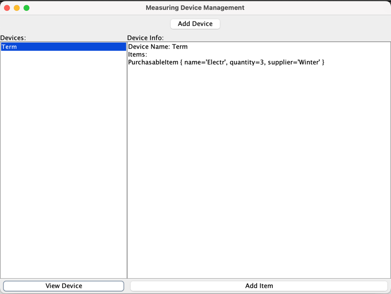

# Лабораторна робота №8 Графічний інтерфейс користувача. Java

## Мета лабораторної роботи –
Придбання навичок створення графічного інтерфейсу користувача в інтегрованих середовищах програмування.

## Вхідні дані до лабораторної роботи:
В лабораторній роботі застосовуються результати лабораторної роботи№3. та обробки виняткових ситуацій у програмах на мові Java.

## Виконання лабораторної роботи
Відповідно до завдання для лабораторної роботи №2 створити класи в інтегрованому середовищі з використанням графічного інтерфейсу. Продемонструвати роботу з об'єктами класу.

## Висновок: 
На цій лабораторній роботі придбав навички створення графічного інтерфейсу користувача в інтегрованих середовищах програмування.

**Результат:**

Лінк на [ГуглДокумент звіту](https://docs.google.com/document/d/177owaq0hjT9fjjO6mNf1jp2yuT39FIUSq40MSzrmCCY/edit?usp=sharing).
